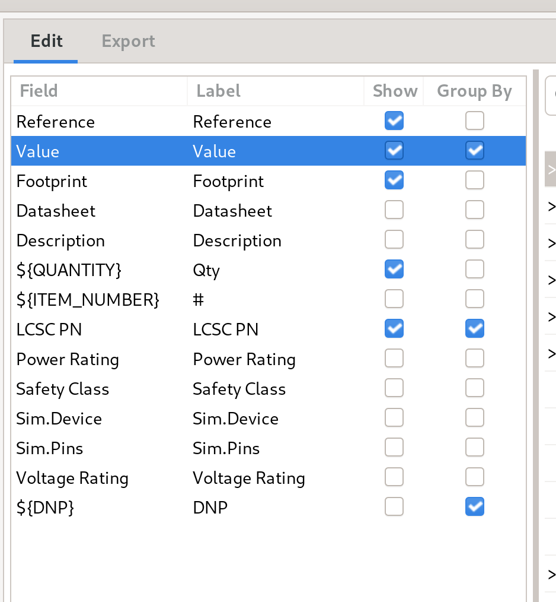
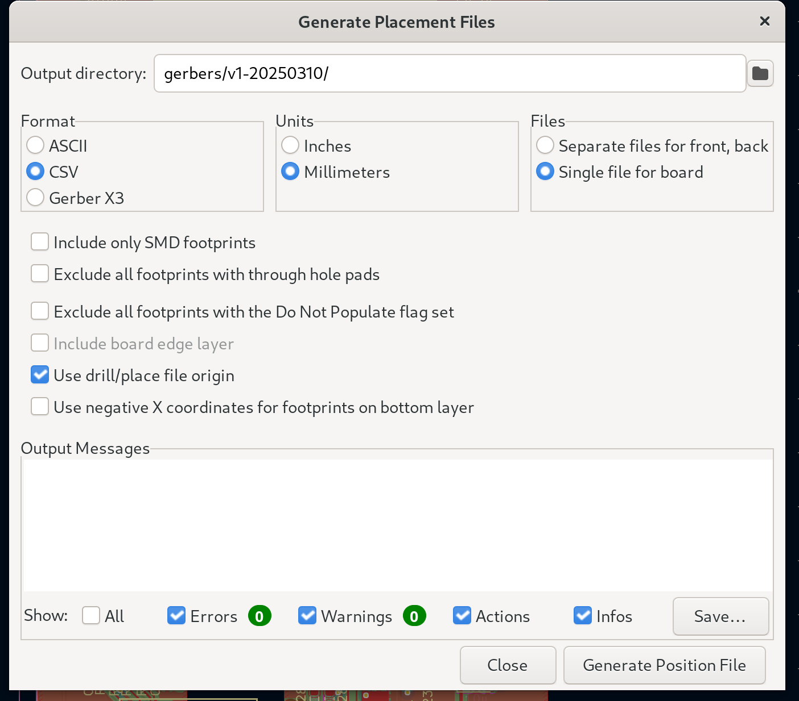

# Board Files

The boards are designed with/for KiCad v8.0.x

## JLCPCB Manufacturing and Assembly

### Gerbers and Drill Files

Follow the instructions here:

https://jlcpcb.com/help/article/how-to-generate-gerber-and-drill-files-in-kicad-8

### Bill of Materials (BOM)

In eeschema, go to `Tools` -> `Generate Bill of Materials`.

In the edit tab configure the fields as follows:



Then click on `Generate` and save the file as `<board>-bom.csv` in the manufacturing files folder.

### Pick and Place (CPL)

In pcbnew, go to `File` -> `Fabrication Outputs` -> `Component Placement (.pos, .gbr)...`.

Configure the fields as follows:



Then click on `Generate`.

### Convert to JLCPCB Format

Use my [jlcfabtool](https://github.com/dpeckett/jlcfabtool) utility to convert the files to the JLCPCB format.

```sh
jlcfabtool bom convert <board>-bom.csv
jlcfabtool placement convert <board>-all-pos.csv
```

### Create the Archive

```sh
cd <board>
zip -r ../$(basename "$(pwd)").zip ./*
```
